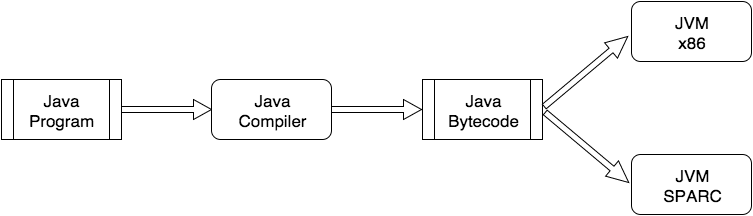

These notes are based on ["Oracle JRockit: The Definitive Guide"]("https://www.packtpub.com/application-development/oracle-jrockit-definitive-guide")

# Chapter 1 - Getting Started

## JVM Parameters
Three kinds of parameters are passed on to the JVM. They are:

* `System Properties` specified by -D flag. Example: -Dconfig_file=file://tmp.properties. These are generally used by the application framework / code.
* `JVM properties` are specified by -X flag followed by the property and value. Example: -Xmx500m . These parameters are used to configure the JVM. These parameters are part of the JVM specification and needs to be implemented by all the implementations of the JVM.
* `Vendor Specific JVM Properties` are specified by -XX flag. These flags are vendor / implementation specific and may not be available in all the JVMs. Example: -XX:+UseConcMarkSweepGC


# Chapter 2 - Adaptive Code Generation

##Platform Independence

* Native binaries, produced from compiled languages like C, C++ is not portable
    - Compilers like GCC highly optimize binaries for the specific target platform. Due to this, the resulting binaries are not portable.
    - Disabling such optimization results in hardware underutilization.
* Java was introduced with two tier architecture.
    - Java compiler that compiles Java code into platform independent Java Bytecode
    - Java Virtual Machine (JVM) - A fast and platform dependent interpreter to execute Java Bytecode.
    - Idea is to build and ship platform independent binaries and leave the rest to the JVM.



##Java Virtual Machine (JVM)

* JVM specs define JVM as a state machine. It might help if we can visualize it as a kind of processor with Bytecode as its instruction set.
    
### Bytecode Format & Interpretation

* Implemented as a stack machine. Any operation retrieves its operands from a stack, evaluate and then push the result back to stack.
* Java opcodes consumes 1 Byte, resulting in a total of 256 opcodes.
* Each opcode has two representations - machine readable 1 byte representation and a more readable one.
* Each opcode can optionally take in operands

#### Example 1 : Function to add two integers

In the below example, when the function `add` is called, local variables `a` and `b` are loaded into a local array storage called "frame" with index starting from 1 (0 allocated for `this` object). Each method has a dedicated one "frame" as its execution context. Bytecode of `add` function just consumes 4 bytes in comparison to the original text

* ```
shell->cat Main.java
public class Main {
    public int add(int a, int b) {
        return a+b;
    }
}
shell->javap -c Main
Compiled from "Main.java"
public class Main {
  public Main();
    Code:
       0: aload_0
       1: invokespecial #1                  // Method java/lang/Object."<init>":()V
       4: return

  public int add(int, int);
    Code:
       0: iload_1
       1: iload_2
       2: iadd
       3: ireturn
}
```

#### Example 2 : Function to check if number is even or not

* ```
shell->cat Main.java
public class Main {
    public boolean isEven(int x) {
        return x % 2 == 0;
    }
}
shell->javap -c Main
Compiled from "Main.java"
public class Main {
  public Main();
    Code:
       0: aload_0
       1: invokespecial #1                  // Method java/lang/Object."<init>":()V
       4: return

  public boolean isEven(int);
    Code:
       0: iload_1
       1: iconst_2
       2: irem
       3: ifne          10
       6: iconst_1
       7: goto          11
      10: iconst_0
      11: ireturn
}
```

### Constant Pool

* Data like method pointers, constants are stored in the beginning portion of a .class file called Constant Pool. This ensures bytecode references to constants / method names are compact.

* ```
shell->javap -c -verbose Main
Constant pool:
   #1 = Methodref          #5.#17         //  java/lang/Object."<init>":()V
   #2 = String             #18            //  Hello World!
   #3 = Fieldref           #4.#19         //  Main.someConst:Ljava/lang/String;
...
  public java.lang.String returnHello();
    descriptor: ()Ljava/lang/String;
    flags: ACC_PUBLIC
    Code:
      stack=1, locals=1, args_size=1
         0: ldc           #2                  // String Hello World!
         2: areturn
      LineNumberTable:
        line 6: 0
}
```

### Code Generation

* Three strategies
    - **Pure Bytecode interpretation** - An implementation of JVM can just emulate that processor (think of a glorified switch construct with one case of each intrinsic). This method is simple to port to other platform but can be slow.

    - **Ahead of Time (AoT) Compilation** - Similar to C/C++ compilers, Compile Java code / Bytecode to native. Depending on the implementation, this can be less portable and does not offer adaptive runtime optimizations.

    - **Just-In-Time Compilation** - Compile a portion of program to native platform dependent code while the method is about to be executed and inturn call the native code. This method offers significant speedups with some bookkeeping and code compilation time overhead which can be overcome by following methods:
        - Prefer Mixed mode instead of Total JIT, starting with interpretation and then JIT compiling only hot methods
        - Tiered compilation, JIT compile to a quick and dirty version and then continuously optimize when more information about the function is available

* Determining "hotness"
    - **Invocation Counters** - Counter associated to each method. Handled by Bytecode interpreter or by an add intruction in the JIT compiled code.

    - **Software based thread sampling** - Pause all the threads once in a while and instrument the region of the program in which the thread spends lots of its time. 

    - **Hardware based sampling** - Specialised support in hardware for sampling is available in few processors like IA-64. Can give lots of metrics like CPU cache misses etc.

* Adaptive runtimes (mixed-mode JIT) can do optimizations in an adaptive fashion based on few assumptions. It comes up with assumption rules like "when there is only one implementation of the vitual method call, inline it into static method call" etc.. If this assumption ceases to be valid, it chucks out the JIT compiled code and goes back to Bytecode interpretation till next JIT compile cycle.

### JRockit Code Pipeline

* JRockit VM comes with a layered code pipeline with initial layers being platform independent and final layers more targeted towards a particular platform. Intention is to implement most of the portable optimizations in the initial layers so that its applicable to all platforms.

* JRockit was targetted for server platform, where process can take a while to startup but run for a long time. Because of this JRockit follows a Tiered Total JIT Compilation strategy without a Bytecode Interpreter.

#### Stage 1 : Bytecode parsing and verification

* Java Bytecode is more expressive than the Java source code. In sense, things that are not possible in Java sourcecode could be done using Java Bytecode. Example: Jumping into body of a loop without going through the loop headers. This is avoided to certain extent by the process called `Bytecode Verification`

* Similar to C/C++ compiler frontends, It may be worthwhile to decompile parsed bytecode representation into AST to understand the context of instructions and apply optimizations further. JRockit comes with a decompiler as the first stage and if it fails, native JIT compiler kicks in.

#### Stage 2 : Bootstrapping the JVM

* Lookup for the `main` class and its dependencies. Compile all the dependencies followed by compilation of the main class itself into native code.

* Once the native code is ready, It is then called using the JNI to handle the control to the Java program.

* Exercise : Write a "hello world" program execute it using `-Xverbose:codegen` flag to get a glimpse of code generation

#### Stage 3 : Runtime code generation

* JIT Compilation is a lazy process. Only when a particular method is invoked for the first time, JRockit will generate native code for the method, load and invoke it

* JRockit accomplishes this with the help of stub methods called `Trampolines`. Whenever a method is invoked for the first time, a stub gets called. This stub initiates the code generation process for the targeted method and spins till that method is ready for execution. Once the native code is compiled, loaded and ready, control is going to traferred to the compiled code. In the meantime, if the same method is going to be called from somewhere else, a trap is generated which will be handled by exception handlers to redirect to the JIT compiled version. This process is called `backpatching`. This process is heavily used during code regenerations as well.

* Code generation requests falls into two categories:
    - `Synchronous`, is used to quickly JIT compile a basic version of the function or initiate requests to regenerate a hot function with more optimizations
    - `ASynchronous`, is used to replace the pointers to the older version of the JIT compiled code to point to the newer version.

* A priority queue is used to schedule code generation depending on the type of the tasks - `Code Generation Queue` or `Optimization Queue`

* When a method is tagged as hot and its JIT Compiled, its possible to replace the already executing instance of the method with the JIT compiled version using `On-Stack Replacement (OSR)`. JRockit does not do it.

* JRockit also takes care of bookkeeping process:
    - Object informations for GC
    - Source code information for debugability
    - Assumption made for JIT compiling the code
